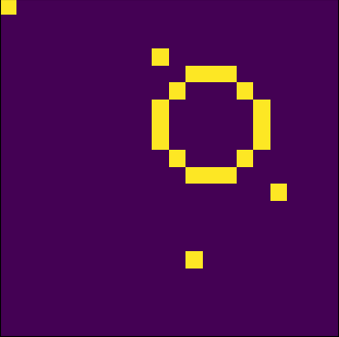
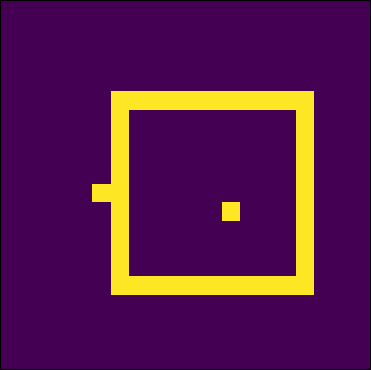
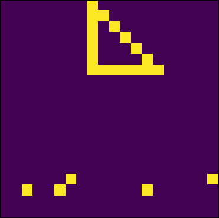
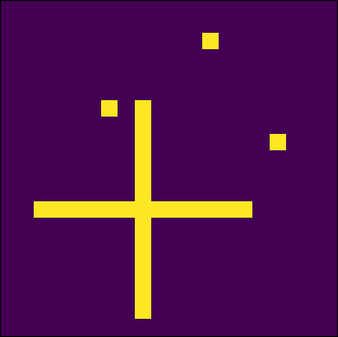
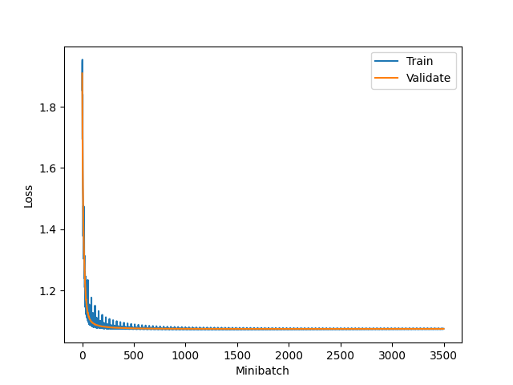
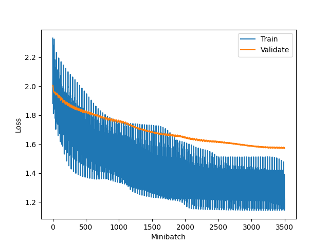
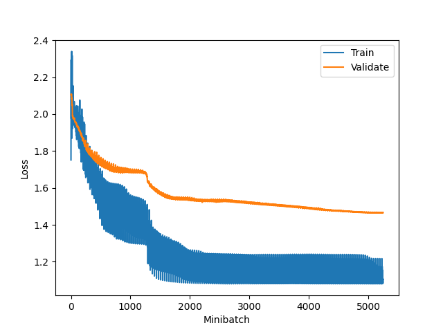

# Deep Neural Network 🧠

This project was part of the Deep Learning (IT3030) course at NTNU spring 2022. The aim of this project was to create a deep neural network library from scratch and implement the backpropagation algorithm. Part of the project was also to generate data and test the neural network on it, as well as defining a format for config-files where neural net and data format could be specified.

## Data generation

The data generated consists of 2D-images of four different shapes: circle, square, triangle and cross. It is possible to specify:

- The image dimensions, n x n pixels (works best for n between 10 and 50)
- The length and width range of shapes as fractions of the whole image (length fractions between 0.20 and 0.40, and width fractions between 0.02 and 0.04 works best)
- Noise percentage (how much random noise there should be in an image)
- Whether or not the shapes should be centered
- The size of the dataset
- The size of the train, valid and test set as fractions of the whole dataset

Examples of 20x20 images with 1% noise and without centering are given below:

 

 

## Configuration files ⚙️

In the configuration files it is possible to specify the data that the neural network is to be trained and tested on (more info [here](#data-generation)), as well as the neural network architecture. For the neural net it is possible to specify:

- Loss function (mean-squared-error or cross-entropy)
- Whether or not to have a softmax layer
- Number of different target classes in the data (default is 4 as the data contains four shapes)
- Regularizer (L1, L2 or None), as well as regularization rate
- Number of epochs for training
- Batch size

For each hidden layer + output layer, you can specify:

- Number of neurons
- Activation function (sigmoid, tanh, relu or linear)
- Initial weight ranges
- Learning rate

Config files are located in the [configs](/configs/) folder.

## Installation 📦

To install the required packages, use the following command: `pip install -r requirements.txt`

## Running a model

To run a model, it (and the data) first needs to be specified. This is done in a [configuration file](#configuration-files), in the [configs](/configs/) folder. You could either modify the `config_main.ini` file, or create your own config-file and specify the path to it in the `main()` function in the `main.py` file. To create, train and test the model, run the main.py file: `python main.py`.

## Results ✅

It is possible to change a lot of parameters and view their effect on the neural network performance, but here we only focus on a select few. We look at a neural network with two hidden layers (both 75 neurons and ReLU activation), and a large dataset of 800 images (all centered). To get an indicator of the neural network performance, we look at the loss over time.

We then set centering to false:

We see that it is considerably harder for the model to classify the images properly. Having centered shapes (as is done in the MNIST dataset) reduces the amount of variation in the data, hence making it easier to classify.

Adding noise to the image is another way of increasing variation in the dataset, thus making the neural network more robust when predicting.

If we make the neural net deeper by adding two hidden layers and train over more epochs, we get the following results:

We see that the deeper neural network performs better.

## What I have learned

Through this project I have gotten a deeper understanding of how backpropagation works, and especially the mathematical basis behind it. I have also gotten some experience with advanced matrix operations in numpy, where the `np.einsum()` function has been very helpful!

## Future work 🚀

Future work on this project could include:

1. **Testing on different datasets**: It would be interesting to test how well a neural network from this library would perform on other datasets, like for example MNIST, and compare its performance to other neural network libraries like TensorFlow and PyTorch.

2. **Add support for Dropout**: Dropout layers could be useful in preventing overfitting.

3. **Optimizing the code**: This could be making the data generation and backpropagation faster, less memory usage, randomly choosing minibatches during training (like in stochastic gradient-descent) etc.
